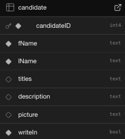
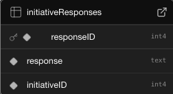

# Election Management Platform

This is a  full-stack election system for managing voters, ballots, initiatives, and results at scale.
Built with Node.js/Express, PostgreSQL, JWT role-based auth, Redis caching, and Pino logging.
Designed to simulate enterprise workloads (20k+ users, 1.4M+ votes) with auditing, analytics views, and robust DB features (materialized views, triggers, PL/pgSQL).

## Highlights
- Realistic Scale: 20K+ users, 1.4M+ votes
- Secure auth: JWTs with granular roles & permissions.
- DB power features: materialized views, triggers, stored functions for eligibility & analytics.
- Performance: Redis caching + indexed queries; Pino structured logs.
- Auditing: append-only audit trail for admin actions & ballot events.
- API: clean REST endpoints with pagination, filtering, and input validation.
- Dev Ops: Metrics, Commit and Push Hooks with env based config

## Tech Stack
- Backend: Node.js, Express
- Database: PostgreSQL (Prisma ORM, PL/pgSQL, triggers, materialized views)
- Cache/Analytics: Redis
- Auth: JWT (access + refresh)
- Logging: Pino (JSON structured logs)
- Testing: Jest

## Database


### Table Descriptions

- **user**  
  Stores user system accounts.  
  Enforced with role-based permissions.  
  

- **candidate**  
  Stores candidate records and related information.  
  Linked to `positionVotes` and `user`.  
  

- **ballots**  
  Stores voter registration records and eligibility attributes.  
  Linked to `positionVotes` and `user`.  
  

- **company**  
  Stores company information and related associations.  
  Linked to `employeeSocietyAssignment` and `user`.  
  

- **ballotPositions**  
  Stores positions available on ballots.  
  Linked to `positionVotes` and `ballots`.  
  

- **ballotInitiatives**  
  Stores initiatives available on ballots.  
  Linked to `initiativeVotes` and `ballots`.  
  

- **initiativeResponses**  
  Stores initiative responses submitted by voters.  
  Linked to `initiativeVotes` and `user`.  
  

- **ballotCandidates**  
  Stores the association of candidates with ballots.  
  Linked to `candidate` and `ballots`.  
  

- **votes**  
  Stores individual votes cast.  
  Linked to `positionVotes` and `user`.  
  

- **positionVotes**  
  Stores votes related to ballot positions.  
  Linked to `ballotPositions` and `user`.  
  
  
- **initiativeVotes**  
  Stores votes related to ballot initiatives.  
  Linked to `ballotInitiatives` and `user`.  
  

- **employeeSocietyAssignment**  
  Stores employee-to-society assignments within a company.  
  Linked to `company` and `user`.  
  


### Materialized Views

- **`user_voting_status`**  
  Snapshot of each user’s voting status across all ballots in their company.  
  Used for dashboards, quick “who has/hasn’t voted” checks, and progress reporting.

### Functions

- **`check_ballot_voter(p_ballot_id int, p_user_id int) RETURNS boolean`**  
  Returns `TRUE` if the given user has cast a vote in the specified ballot, otherwise `FALSE`.  
  Useful for API guards and ensuring a user cannot vote more than once.  

- **`get_ballot_voting_status(p_ballot_id int) RETURNS TABLE (...)`**  
  Provides both aggregate stats (percentage, counts) and per-member voting status for a ballot’s company.  
  Outputs each member’s info (`user_id`, `username`, `fname`, `lname`) alongside their `has_voted` flag.  
  Designed for dashboards showing overall progress and who has/hasn’t voted.

## Prisma as Database Connector & Middle Layer

This project uses **Prisma ORM** as the bridge between the **PostgreSQL database** and the **Node.js/Express API layer**. Prisma serves two important roles:

1. **Database Connector**  
   - Manages connections to PostgreSQL through a type-safe client.  
   - Provides a clean abstraction over raw SQL while still allowing custom SQL and PL/pgSQL functions when needed.  
   - Handles migrations and schema synchronization with `prisma migrate`, ensuring consistency across environments.

2. **Middle Layer (Domain Access Layer)**  
   - Encapsulates queries and transactions in a **service-like API** for the rest of the application.  
   - Enforces type safety at compile-time (`TypeScript` integration), reducing runtime errors.  
   - Simplifies complex operations like filtering, pagination, and joins into concise and maintainable code.  
   - Works alongside raw SQL features like **materialized views, triggers, and stored functions**, enabling the best of both ORM convenience and database power.

**Benefits for the Project**
- **Productivity**: Developers can focus on business logic instead of boilerplate SQL.  
- **Safety**: Type-safe queries prevent common mistakes (wrong field names, mismatched types).  
- **Flexibility**: Allows mixing Prisma with raw SQL for advanced features (e.g., `user_voting_status` MV or `get_ballot_voting_status()` function).  
- **Maintainability**: Centralized schema and generated client make it easy to evolve the DB model without breaking code.  

**Example**
```ts
  const fetchUser = await prisma.user.findUnique({
    where: {
      username: username,
    },
      select: {
        userID: true,
        accountType: true,
        username: true
        },
    });
```

## Roles & Permissions

The platform uses **role-based access control (RBAC)** to enforce security and ensure users can only perform actions appropriate to their role.  

| Role              | Description                                                                 | Key Permissions                                                                 |
|-------------------|-----------------------------------------------------------------------------|--------------------------------------------------------------------------------|
| **Society Member** | Base-level participant (e.g., a registered voter or community member).      | - View elections and contests <br> - Cast their own ballot <br> - View their voting history/status |
| **Society Officer** | Elevated community role with limited administrative powers.                | - All Society Member permissions <br> - Create/manage events within their society <br> - View aggregate participation reports for their group |
| **Employee**       | Internal staff user supporting election operations or platform tasks.       | - Manage voter registrations <br> - Issue and revoke ballots <br> - Assist with troubleshooting voter accounts |
| **Officer**        | Full administrative authority (system or organizational officer).           | - All Employee permissions <br> - Configure elections and contests <br> - Manage candidates and initiatives <br> - Refresh materialized views <br> - Audit logs and system actions <br> - Manage roles and permissions for other users |


## API 

### Express + Nodejs + Typescript

- **Authentication:**  
  User login issues a **signed & encrypted session token** (`user_session`) as an **HttpOnly cookie**.  
  Cookie TTL: ~24h, `SameSite=Lax`, `secure=true` in production.  

- **Authorization:**  
  Role-based access control (RBAC) is enforced via `requireRole(...)`.  
  Roles: **Admin**, **Employee**, **Officer**, **Member**.  

- **Validation:**  
  All request bodies and query parameters are validated with **Zod** schemas.  
  Invalid inputs return **400** with detailed messages.  

- **Error Model:**  
  - `400` – invalid request / validation errors  
  - `401` – not authenticated  
  - `403` – unauthorized (role mismatch / restricted resource)  
  - `404` – entity not found  
  - `409` – conflict (e.g., username exists)  
  - `500` – internal server error  

- **Observability:**  
  Logging with **Pino** and system statistics endpoints (`/getSystemReport`, `/getCompanyStats`) expose DB + HTTP metrics.  

### Routes

> Unless noted, protected endpoints require a valid `user_session` cookie and pass `requireRole(...)`.  
> Request bodies/queries are validated with **Zod**; invalid inputs return **400** with messages.

| Method | Path | Roles Required | Params (Query / Body) | Success Response | Error Responses |
|-------:|------|----------------|------------------------|------------------|-----------------|
| **POST** | `/login` | None | **Body**: `username`, `password` | **200** `{ message, user }` and sets `user_session` cookie | 400 invalid/zod • 401 invalid credentials • 500 failed login |
| **POST** | `/logout` | None | Cookie: `user_session` | **200** `{ message }` (clears cookie) | 401 not logged in • 500 failed logout |
| **POST** | `/createUser` | None | **Body**: `username`, `password`, `fName`, `lName`, `companyID`, `accountType` (`Admin` \| `Member` \| `Officer` \| `Employee`) | **201** `{ message, user }` | 400 invalid/zod • 404 company missing • 409 username exists • 500 failed |
| **DELETE** | `/deleteUser` | Admin | **Body**: `username` | **200** `{ message }` | 400 invalid/zod • 404 user does not exist • 500 failed |
| **GET** | `/getAllUsers` | Admin | — | **200** `users[]` | 400 invalid • 404 not found • 500 failed |
| **GET** | `/getAllCompanies` | Admin | — | **200** `companies[]` | 400 invalid • 404 not found • 500 failed |
| **GET** | `/getSystemReport` | Admin, Employee | — | **200** `{ activeUsers, activeElectionsCount, inactiveElectionsCount, queryStats, httpStats }` | 400 invalid • 404 stats not found • 500 failed |
| **GET** | `/getSocietyReport` | Admin | **Query**: `companyID` (int) | **200** stats | 400 invalid/zod • 404 stats not found • 500 failed |
| **GET** | `/getCompanyStats` | Officer, Employee, Admin | **Query**: `companyID` (int) | **200** stats | 400 invalid/zod • 404 stats not found • 500 failed |
| **GET** | `/getCompanyUsers` | Officer, Employee, Admin | **Query**: `companyID` (int) | **200** `users[]` | 400 invalid/zod • 500 internal error |
| **GET** | `/getUser` | None | **Query**: `username` | **200** user | 400 invalid/zod • 404 not found • 500 failed |
| **GET** | `/getUserByUsername` | Admin, Member, Officer, Employee | **Query**: `username` | **200** user | 400 invalid/zod • 404 not found • 500 failed |
| **GET** | `/ping` | Admin, Member, Officer, Employee | **Query**: `username` | **200** `{ message }` (sets `active:<username>` in Redis, TTL 120s) | 400 invalid/zod • 404 user not found • 500 failed |
| **GET** | `/getEmployeeCompany` | Admin, Member, Officer, Employee | **Query**: `userID` (int) | **200** company | 400 invalid/zod • 404 user not found • 500 failed |
| **GET** | `/getAssignedCompanies` | Employee | **Query**: `userID` (int) | **200** `companies[]` (authorized assignments) | 400 invalid/zod • 404 none found • 500 failed |
| **GET** | `/getBallots` | None | **Query**: `page` (cursor int, optional) | **200** `{ ballots[], nextCursor, hasNextPage, hasPreviousPage, totalCount }` | 400 invalid cursor • 404 none found • 500 failed |
| **GET** | `/getBallot` | Admin, Member, Officer, Employee | **Query**: `ballotID` (int) | **200** ballot | 400 invalid/zod • 404 not found • 500 failed |
| **GET** | `/getBallotStatus` | Officer, Employee, Admin | **Query**: `ballotID` (int) | **200** status | 400 invalid/zod • 404 ballot not found • 500 failed |
| **GET** | `/getCompanyBallots` | Admin, Member, Officer, Employee | **Query**: `companyID` (int) | **200** `ballots[]` | 400 invalid/zod • 404 not found • 500 failed |
| **GET** | `/getActiveCompanyBallots` | Admin, Member, Officer, Employee | **Query**: `companyID` (int) | **200** `ballots[]` | 400 invalid/zod • 404 not found • 500 failed |
| **GET** | `/getInactiveCompanyBallots` | Admin, Member, Officer, Employee | **Query**: `companyID` (int) | **200** `ballots[]` | 400 invalid/zod • 404 not found • 500 failed |
| **GET** | `/getActiveUserBallots` | Admin, Member, Officer, Employee | **Query**: `userID` (int) | **200** `ballots[]` | 400 invalid/zod • 404 none found • 500 failed |
| **GET** | `/getInactiveUserBallots` | Admin, Member, Officer, Employee | **Query**: `userID` (int) | **200** `ballots[]` _or_ `{ ballot: 'No inactive ballots found' }` | 400 invalid/zod • 500 failed |
| **GET** | `/getUserBallots` | Admin, Member, Officer, Employee | **Query**: `userID` (int) | **200** `ballots[]` | 400 invalid/zod • 404 none found • 500 failed |
| **POST** | `/createBallot` | Employee, Admin | **Body**: `ballotName`, `description`, `startDate`, `endDate`, `companyID`, `positions[]`, `initiatives[]` | **201** `{ message }` | 400 invalid/zod • 404 company not found • 500 failed |
| **POST** | `/createBallotFromList` | Employee, Admin | **Body**: `ballotName`, `description`, `startDate`, `endDate`, `companyID`, `positions[]`, `initiatives[]`, `userID` | **201** `{ message }` | 400 invalid/zod • 403 unauthorized company • 404 company not found • 500 failed |
| **PUT** | `/updateBallot` | Employee, Admin | **Query**: `ballotID` (int) <br> **Body**: `ballotName`, `description`, `startDate`, `endDate`, `companyID`, `positions[]`, `initiatives[]` | **200** `{ message }` | 400 invalid/zod • 404 ballot/company not found • 500 failed |
| **POST** | `/submitBallot` | Member, Officer | **Body**: `{ ballot }` (`BallotSchema`) | **201** `{ message }` | 400 invalid/zod • 500 failed |
| **GET** | `/voterStatus` | Member, Officer | **Query**: `ballotID`, `userID` (ints) | **200** `{ voterStatus: boolean }` | 400 invalid/zod • 404 ballot not found • 500 failed |
| **GET** | `/viewBallotResults` | Officer, Employee, Admin, Member | **Query**: `ballotID` (int) | **200** tally/results | 400 invalid/zod • 404 ballot not found • 500 failed |

## Security and Auditing

### Authentication & Sessions
- **HttpOnly Cookie**: `user_session` (signed/encrypted), `SameSite=Lax`, `secure` in production, 24h TTL.  
- **Logout**: Explicit cookie clear; server treats missing/invalid token as unauthenticated.  
- **Password Storage**: `bcrypt` with a strong cost factor; no plaintext recovery.  

### Authorization (RBAC)
- **Route Guards**: `requireRole(...)` enforces **Admin**, **Employee**, **Officer**, **Member**.  
- **Principle of Least Privilege**: Each role only has access to required endpoints.  

### PostgreSQL Roles & Permissions
At the database level, fine-grained roles enforce **separation of duties**:  

| Role | Purpose | Permissions |
|------|----------|-------------|
| **ElectionDBA** | Database administrator | Full superuser-like rights: schema changes, role management, backup/restore, MV refresh scheduling. Restricted to DBA accounts only. |
| **ElectionDev** | Developer role for migrations and safe development tasks | `CREATE/ALTER` on dev schema, can run migrations, create views, write functions. **Cannot** drop production schemas or access PII tables directly. |
| **ElectionSystemUser** | Runtime role for the API server | Minimal privileges: `SELECT/INSERT/UPDATE` only on whitelisted tables (`users`, `ballots`, `votes`, `audit_log`). No `DROP`, `ALTER`, or DDL permissions. Bound to Prisma connection pool. |

### Input & Transport Security
- **Validation**: Zod on **every** query/body; IDs must be positive integers; usernames restricted to `[A-Za-z0-9_]`.  
- **TLS Everywhere**: Terminate HTTPS at proxy/load balancer; `secure` cookies in prod.  
- **CORS**: Only trusted frontend origins allowed; `credentials: true`.  

### Data Security
- **Minimal Exposure**: APIs only return necessary fields (`select` in Prisma).  
- **Encryption at Rest**: DB and Redis deployed on encrypted volumes; backups encrypted.  
- **Secrets Management**: Environment vars (JWT/session keys, DB creds) rotated and never stored in repo.  

### Threat Model

The following attack vectors were considered and mitigated:

- **SQL Injection** → Prevented by using **Prisma ORM** and parameterized queries.  
- **Cross-Site Scripting (XSS)** → Cookies are `HttpOnly`, frontend sanitizes inputs, API never echoes unsanitized user content.  
- **Cross-Site Request Forgery (CSRF)** → Mitigated by `SameSite=Lax` cookies; sensitive routes require valid sessions.  
- **Brute-Force / Credential Stuffing** → Blocked with rate limiting + `bcrypt` password hashing.  
- **Replay Attacks** → Session cookies have short TTL and are rotated on login/logout.  
- **Privilege Escalation** → Enforced through strict role checks at middleware + DB role separation (`ElectionSystemUser` cannot modify schema).  
- **Insider Misuse** → `audit_log` (via Pino + Prisma logs) provides immutable evidence of all admin-sensitive actions.  
- **Denial of Service (DoS)** → Node server hardened with request size limits, Redis used for caching active sessions to reduce DB load.  


### Auditing

This project uses **log-based auditing** (via [Pino](https://getpino.io/)) instead of database triggers or audit tables.  
Both HTTP traffic and database queries are logged in real time and stored in local log files.

- **Application-Layer Auditing**  
  - An Express middleware with **Pino** intercepts all HTTP requests.  
  - Captures: `timestamp`, `reqId`, `method`, `url`, `statusCode`, `responseTime`, and the authenticated `user`/`role`.  
  - Logs are stored in **`log/app.log`** as line-delimited JSON.  

- **Database-Layer Auditing**  
  - Prisma client is extended with a `$use` middleware.  
  - Captures: `timestamp`, `reqId`, `model`, `action` (`findMany`, `create`, `update`), and `durationMs`.  
  - Logs are stored in **`log/db.log`** as line-delimited JSON.  

- **Log Format**  
  - Both `app.log` and `db.log` are JSON logs, suitable for parsing, shipping, or feeding into observability stacks (ELK, Datadog, Loki, etc.).  
  - Each log entry is correlated via `reqId` to provide an end-to-end trace of request → DB queries → response.  

- **Benefits**  
  - Full visibility into request/response cycles and DB usage patterns.  
  - No schema bloat (audit tables avoided).  
  - Useful for debugging performance, detecting anomalies, and incident investigations.

#### Example Audit Entry

**`app.log`** (HTTP request audit):  
```json
{
  "time": "2025-08-26T14:22:07.112Z",
  "level": "info",
  "reqId": "d93ac7f1",
  "method": "POST",
  "url": "/submitBallot",
  "statusCode": 201,
  "responseTime": 142,
  "user": "member42",
  "role": "Member"
}
```

## Frontend 

DESCRIPTION 

SCREENSHOTS 

